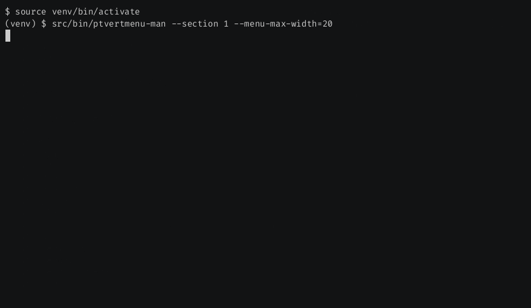

[](https://github.com/lpenz/ptvertmenu/actions/workflows/ci.yml)
[](https://coveralls.io/github/lpenz/ptvertmenu?branch=main)
[](https://pypi.org/project/ptvertmenu/)
[](https://github.com/lpenz/disk-img-tool/releases)


# ptvertmenu

Vertical menu widget for the excellent [prompt-toolkit], with optional
fzf-inspired search

This is a demo of the included [ptvertmenu-man](src/bin/ptvertmenu-man) utility:




## Getting started

The example below creates a menu that shows the contents of files and
directories as the cursor goes over them, with full mouse support:

```.py
#!/usr/bin/env python3
"""
Look at files in the current directory
"""

import os
from typing import Optional, Any

import ptvertmenu
from prompt_toolkit import Application
from prompt_toolkit.key_binding import KeyBindings
from prompt_toolkit.key_binding.bindings.focus import focus_next
from prompt_toolkit.key_binding.key_processor import KeyPressEvent
from prompt_toolkit.layout.containers import VSplit
from prompt_toolkit.layout.layout import Layout
from prompt_toolkit.styles import Style
from prompt_toolkit.widgets import Frame, TextArea

E = KeyPressEvent


def showfile(contents: TextArea, item: Optional[tuple[str, Any]], index: int) -> None:
    assert item
    name = item[1]
    try:
        if os.path.isdir(name):
            contents.text = '\n'.join(os.listdir(name))
        else:
            with open(name, "r", encoding="utf-8", errors="replace") as fd:
                contents.text = fd.read()
    except Exception as exc:
        contents.text = f"Error: {exc}"


def main() -> None:
    files = [(f, f) for f in os.listdir(".")]
    contents = TextArea(text="", multiline=True, wrap_lines=True, read_only=True)
    menu = ptvertmenu.VertMenu(
        items=files,
        selected_handler=lambda item, index: showfile(contents, item, index),
    )
    root_container = VSplit(
        [
            Frame(title="Files", body=menu),
            Frame(title="Contents", body=contents),
        ]
    )
    layout = Layout(root_container)
    style = Style.from_dict({"vertmenu.selected": "reverse"})
    kb = KeyBindings()

    @kb.add("tab")
    def tab(event: E) -> None:
        focus_next(event)

    @kb.add("c-d")
    @kb.add("c-c")
    def close(event: E) -> None:
        app.exit()

    app: Application[None] = Application(
        layout=layout,
        full_screen=True,
        style=style,
        key_bindings=kb,
        mouse_support=True,
    )
    app.run()


if __name__ == "__main__":
    main()
```

## Installation


### Releases

ptvertmenu can be installed via [pypi]:

```
pip install ptvertmenu
```

For [nix] users, it is also available as a [flake].


### Repository

We can also clone the github repository and install ptvertmenu from it with:

```
pip install .
```

We can also install it for the current user only by running instead:

```
pip install --user .
```


## Development

ptvertmenu uses the standard python3 infra. To develop and test the module:
- Clone the repository and go into the directory:
  ```
  git clone git@github.com:lpenz/ptvertmenu.git
  cd ptvertmenu
  ```
- Use [`venv`] to create a local virtual environment with
  ```
  python -m venv venv
  ```
- Activate the environment by running the shell-specific `activate`
  script in `./venv/bin/`. For [fish], for instance, run:
  ```
  source ./venv/bin/activate.fish
  ```
- Install ptvertmenu in "editable mode":
  ```
  pip install -e '.[test]'
  ```
- To run the tests:
  ```
  pytest
  ```
  Or, to run the tests with coverage:
  ```
  pytest --cov
  ```
- Finally, to exit the environment and clean it up:
  ```
  deactivate
  rm -rf venv
  ```


[pypi]: https://pypi.org/project/ptvertmenu/
[nix]: https://nixos.org/
[flake]: https://nixos.wiki/wiki/Flakes
[`venv`]: https://docs.python.org/3/library/venv.html
[prompt-toolkit]: https://github.com/prompt-toolkit/python-prompt-toolkit
